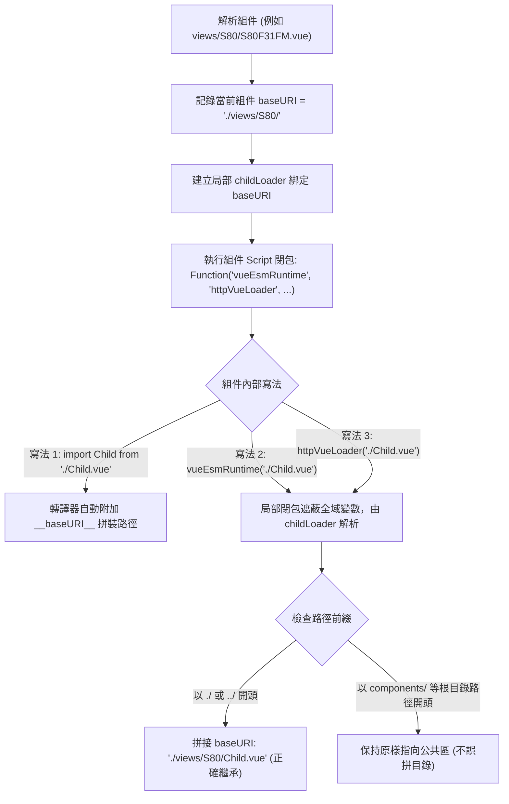

# vueEsmRuntime 專案升級與路徑繼承優化建議書

## 一、問題背景與修改摘要

在實際專案將傳統 Vue 2 SFC 載入器（`httpVueLoader`）替換為 `vueEsmRuntime` 的實踐過程中，發現並解決了三項核心問題：

| 序號 | 問題現象 | 根本原因 | 建議修改檔案 |
| :--- | :--- | :--- | :--- |
| **1** | **組件內相對路徑請求指向網站根目錄 (404)**<br>例如在 `layout/index.vue` 呼叫 `vueEsmRuntime('./TheNavbar.vue')`，請求卻發往 `/TheNavbar.vue`。 | 傳入組件閉包 `Function(...)` 的 `vueEsmRuntime` 是全域實例，未綁定當前組件所在目錄（`baseURI`），導致相對路徑遺失目錄前綴。 | `src/context/ScriptContext.js` |
| **2** | **舊專案 `httpVueLoader` 遷移相容性缺失**<br>大量存量組件仍調用 `httpVueLoader('...')`，且可能使用 `Vue.use(...)`。 | `vueEsmRuntime` 缺乏 Vue 外掛 `install` 方法，且全域未提供向下相容別名；閉包中無 `httpVueLoader` 變數支援。 | `src/index.js`<br>`src/context/ScriptContext.js` |
| **3** | **`httpRequest` 外部覆寫無法動態委派**<br>外部透過 Axios 覆寫 `vueEsmRuntime.httpRequest` 時，內部模組仍調用原本的原生 XHR。 | `src/utils.js` 導出的 `httpRequest` 為獨立函數，內部其他檔案靜態 import 後不會動態讀取已覆寫的屬性。 | `src/utils.js` |

---

## 二、具體修改檔案與程式碼變更 (Diff)

### 1. `src/context/ScriptContext.js`
> **修改目的**：建立具備目錄記憶的局部作用域加載器 `childLoader`，傳入 Script 閉包環境，讓組件內部的相對路徑能自動繼承當前組件的 `baseURI`，並向下相容 `httpVueLoader`。

#### 修改前後比對：
```javascript
// ==================== 修改前 ====================
_executeScript(scriptContent, childModuleRequire, vueEsmRuntime) {
  const baseURI = this.component ? this.component.baseURI : '';
  Function('exports', 'require', 'vueEsmRuntime', 'module', '__baseURI__', scriptContent).call(
    this.module.exports,
    this.module.exports,
    childModuleRequire,
    vueEsmRuntime,
    this.module,
    baseURI
  );
}

// ==================== 修改後 ====================
_executeScript(scriptContent, childModuleRequire, vueEsmRuntime) {
  const baseURI = this.component ? this.component.baseURI : '';

  // 1. 建立具有當前目錄記憶的局部加載器
  const childLoader = (childURL, childName) => {
    // 若已有完整 baseURI 前綴則不重複拼接，否則依 baseURI 解析相對路徑
    const urlToLoad = (baseURI && typeof childURL === 'string' && childURL.startsWith(baseURI))
      ? childURL
      : resolveURL(baseURI, childURL);
    return vueEsmRuntime(urlToLoad, childName);
  };

  // 2. 繼承複製原有的靜態屬性與方法
  Object.assign(childLoader, vueEsmRuntime);
  childLoader.load = (childURL, childName) => {
    const urlToLoad = (baseURI && typeof childURL === 'string' && childURL.startsWith(baseURI))
      ? childURL
      : resolveURL(baseURI, childURL);
    return vueEsmRuntime.loadComponent(urlToLoad, childName);
  };
  childLoader.loadComponent = childLoader.load;

  // 3. 同時將 childLoader 注入為 'vueEsmRuntime' 與 'httpVueLoader'
  //    遮蔽 (shadow) 全域變數，確保組件內相對路徑與既有寫法皆能正確繼承目錄
  Function('exports', 'require', 'vueEsmRuntime', 'httpVueLoader', 'module', '__baseURI__', scriptContent).call(
    this.module.exports,
    this.module.exports,
    childModuleRequire,
    childLoader,
    childLoader,
    this.module,
    baseURI
  );
}
```

---

### 2. `src/utils.js`
> **修改目的**：讓外部應用自定義的 `vueEsmRuntime.httpRequest`（例如整合 Axios 攔截器、加入 `Pragma: no-cache` 或 JWT Token 標頭）能被內部所有模組（`Component.js`、`loadModule`）確實調用。

#### 修改前後比對：
```javascript
// ==================== 修改前 ====================
export function httpRequest(url) {
  return new Promise((resolve, reject) => {
    const xhr = new XMLHttpRequest();
    // ...
  });
}

// ==================== 修改後 ====================
export function httpRequest(url) {
  // 檢查外部是否已自定義 vueEsmRuntime.httpRequest，若有則優先委派執行
  if (typeof vueEsmRuntime !== 'undefined' && typeof vueEsmRuntime.httpRequest === 'function' && vueEsmRuntime.httpRequest !== httpRequest) {
    return Promise.resolve(vueEsmRuntime.httpRequest(url));
  }
  return new Promise((resolve, reject) => {
    const xhr = new XMLHttpRequest();
    xhr.open('GET', url);
    xhr.responseType = 'text';

    xhr.onreadystatechange = () => {
      if (xhr.readyState === 4) {
        if (xhr.status >= 200 && xhr.status < 300) {
          resolve(xhr.responseText);
        } else {
          reject(new Error('HTTP ' + xhr.status + ': ' + url));
        }
      }
    };

    xhr.send(null);
  });
}
```

---

### 3. `src/index.js`
> **修改目的**：掛載 `install` 外掛介面（支援 `Vue.use(...)`）以及 `load`、`parseComponentURL` 相容別名，並在瀏覽器環境註冊全域別名。

#### 具體修改程式碼：
```javascript
// 在 vueEsmRuntime 定義後，掛載相容性方法
vueEsmRuntime.load = loadComponent;
vueEsmRuntime.parseComponentURL = parseComponentURL;
vueEsmRuntime.parseModuleURL = parseModuleURL;

// 實現 Vue Plugin 規範，支援 Vue.use(vueEsmRuntime)
vueEsmRuntime.install = function (Vue) {
  Vue.mixin({
    beforeCreate: function () {
      var components = this.$options.components;
      if (!components) return;
      for (var componentName in components) {
        if (
          typeof components[componentName] === 'string' &&
          components[componentName].substr(0, 4) === 'url:'
        ) {
          var comp = parseComponentURL(components[componentName].substr(4));
          var componentURL =
            '_baseURI' in this.$options
              ? resolveURL(this.$options._baseURI, comp.url)
              : comp.url;

          if (isNaN(componentName))
            components[componentName] = loadComponent(componentURL, componentName);
          else
            components[componentName] = Vue.component(
              comp.name,
              loadComponent(componentURL, comp.name)
            );
        }
      }
    }
  });
};

// 於瀏覽器全域環境下同時註冊相容別名
if (typeof window !== 'undefined') {
  window.vueEsmRuntime = vueEsmRuntime;
  window.httpVueLoader = vueEsmRuntime; // 支援既有舊函式庫名稱
}
```

---

## 三、修改後的效果與運作機制



### 解析行為對照表：

| 調用寫法（假設位於 `./views/S80/` 下） | 解析後的請求路徑 | 行為說明 |
| :--- | :--- | :--- |
| `import Child from './Child.vue'` | `./views/S80/Child.vue` | **現代 ESM 規範**，語法標準且路徑精確。 |
| `vueEsmRuntime('./Child.vue')` | `./views/S80/Child.vue` | **函數調用繼承**，由局部 `childLoader` 自動附加目錄前綴，不跑到根目錄。 |
| `httpVueLoader('./Child.vue')` | `./views/S80/Child.vue` | **舊專案相容**，無痛升級無須大量搜尋取代。 |
| `vueEsmRuntime('components/IDataTableZZ.vue')` | `components/IDataTableZZ.vue` | **公共組件路徑**（非 `.` 開頭）不受影響，正確指向公共區。 |
